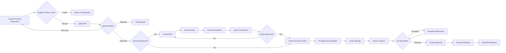

# Phase 5: Procure-to-Pay Workflow Engine Design

## 1. Workflow Scope

This document defines the enterprise workflow logic for the complete E‑Procurement ERP lifecycle:

```text
Purchase Requisition → Approval → RFQ → Vendor Quotation → Quote Comparison
→ Purchase Order → Goods Receipt → Invoice → Payment
```

The workflow engine is designed for policy-driven ERP execution with configurable approvals, segregation of duties, escalations, auditability, notifications, and state-machine governance.

## 2. Core Workflow Principles

1. Every business document has an explicit state, allowed transitions, transition actor, validation rule set, audit event, and notification policy.
2. Users cannot approve documents they created when segregation-of-duties thresholds apply.
3. Approval routing is based on amount, currency, category, company/legal entity, cost center, project, supplier risk, budget status, and contract coverage.
4. All workflow actions are idempotent and produce immutable audit events.
5. Long-running process steps use asynchronous events, SLA timers, reminders, and escalations.
6. Manual overrides require elevated permission, reason code, and audit trail.
7. Payment release is controlled by invoice approval, match status, vendor status, tax validation, and payment hold rules.

## 3. End-to-End Workflow Diagram



## 4. Business Rules

### 4.1 Purchase Requisition Rules

| Rule ID | Rule | Outcome |
| --- | --- | --- |
| PR-BR-001 | PR must contain at least one active line item or service description. | Block submission. |
| PR-BR-002 | Quantity must be greater than zero and unit price must be non-negative. | Block save/submission. |
| PR-BR-003 | Currency must be valid ISO 4217 and allowed for the legal entity. | Block submission. |
| PR-BR-004 | Required-by date cannot be earlier than current date unless emergency override is granted. | Block submission or require justification. |
| PR-BR-005 | Budget check must pass for hard-control cost centers. | Block submission. |
| PR-BR-006 | Soft budget failures require finance approver step. | Add finance approval step. |
| PR-BR-007 | Preferred supplier/contract coverage should be auto-suggested when available. | Route to buyer if requester bypasses contract. |
| PR-BR-008 | Split PR detection triggers procurement compliance review. | Add compliance approval step. |

### 4.2 Approval Rules

| Rule ID | Rule | Outcome |
| --- | --- | --- |
| APR-BR-001 | Creator cannot approve their own document above SoD threshold. | Skip user and escalate to manager/role pool. |
| APR-BR-002 | Approval levels are determined on base-currency converted amount. | Consistent approval thresholding. |
| APR-BR-003 | Approval tasks are sequential unless workflow step is configured as parallel. | Enforce approval order. |
| APR-BR-004 | Rejection requires reason code and comment. | Capture audit evidence. |
| APR-BR-005 | Delegation must preserve approval authority and SoD constraints. | Validate delegate before reassignment. |
| APR-BR-006 | Approval changes after material document modification are invalidated. | Reopen approval. |

### 4.3 RFQ and Quotation Rules

| Rule ID | Rule | Outcome |
| --- | --- | --- |
| RFQ-BR-001 | RFQ is mandatory when PR amount exceeds sourcing threshold or category requires competitive bidding. | Create sourcing event. |
| RFQ-BR-002 | Minimum invited vendors depends on category and amount. | Block RFQ release if invite count is insufficient. |
| RFQ-BR-003 | Late vendor quotes require buyer exception approval. | Mark quote as late and require decision. |
| RFQ-BR-004 | Quote comparison must normalize freight, tax, discount, lead time, quality score, and risk score. | Produce total evaluated cost. |
| RFQ-BR-005 | Award to non-lowest quote requires justification and approval. | Add award approval step. |

### 4.4 Purchase Order Rules

| Rule ID | Rule | Outcome |
| --- | --- | --- |
| PO-BR-001 | PO cannot be issued to blocked or inactive vendor. | Block issue. |
| PO-BR-002 | PO lines must reference approved PR, winning quote, or active contract unless free-text PO permission is granted. | Block creation or require override. |
| PO-BR-003 | PO changes affecting price, quantity, delivery date, supplier, or tax require change-order approval. | Reopen PO approval. |
| PO-BR-004 | PO dispatch requires approved status and valid vendor contact/channel. | Block dispatch. |

### 4.5 Goods Receipt Rules

| Rule ID | Rule | Outcome |
| --- | --- | --- |
| GR-BR-001 | Receipt quantity cannot exceed PO open quantity beyond tolerance. | Block or require receiving supervisor override. |
| GR-BR-002 | Quality-inspection items are placed on hold until accepted. | Prevent invoice auto-match. |
| GR-BR-003 | Rejected receipt quantity must include reason code. | Capture quality audit. |
| GR-BR-004 | Inventory item receipts create inventory movement events. | Update stock ledger. |

### 4.6 Invoice and Payment Rules

| Rule ID | Rule | Outcome |
| --- | --- | --- |
| INV-BR-001 | Duplicate invoice check is based on vendor, invoice number, amount, and invoice date. | Block or flag duplicate. |
| INV-BR-002 | PO invoices require 2-way match for services or 3-way match for goods. | Determine match route. |
| INV-BR-003 | Price, quantity, freight, and tax variances are compared against tolerance matrix. | Auto-approve or create exception. |
| INV-BR-004 | Invoice exceptions are routed to buyer, requester, receiving, tax, or AP based on exception type. | Create resolution task. |
| INV-BR-005 | Payment request requires approved invoice, active vendor, verified bank account, no legal hold, and no payment block. | Release to finance/payment integration. |

## 5. Approval Matrix

### 5.1 Purchase Requisition Approval Matrix

| Amount Range (USD Equivalent) | Required Approver(s) | SLA | Notes |
| --- | --- | --- | --- |
| 0 - 999.99 | Auto approval if budget passes | Immediate | Unless restricted category. |
| 1,000 - 9,999.99 | Cost Center Manager | 24 hours | Sequential approval. |
| 10,000 - 49,999.99 | Cost Center Manager → Department Head | 48 hours | Finance added for soft budget failure. |
| 50,000 - 249,999.99 | Department Head → Procurement Manager → Finance Controller | 72 hours | RFQ normally mandatory. |
| 250,000 - 999,999.99 | Procurement Director → Finance Controller → Business VP | 96 hours | Legal review for services/contracts. |
| ≥ 1,000,000 | CPO → CFO → Executive Committee | 120 hours | Board policy may apply. |

### 5.2 RFQ Award Approval Matrix

| Award Scenario | Approver(s) | Rule |
| --- | --- | --- |
| Lowest compliant quote | Buyer Manager | Standard award. |
| Non-lowest quote within 5% | Buyer Manager → Category Manager | Requires justification. |
| Non-lowest quote above 5% | Category Manager → Procurement Director → Finance Controller | Requires total value justification. |
| Single-source award | Category Manager → Legal/Compliance → Procurement Director | Requires single-source reason. |
| High-risk supplier award | Risk/Compliance → Procurement Director | Required regardless of amount. |

### 5.3 Purchase Order Approval Matrix

| PO Type | Approval Logic |
| --- | --- |
| PO from approved PR and awarded RFQ | Auto approve if amount and vendor unchanged. |
| PO from contract release | Auto approve within release limit; route to buyer manager if exceeded. |
| Free-text PO | Buyer Manager approval mandatory. |
| Change order | Re-approve by impacted original approvers if value/date/supplier changes. |

### 5.4 Invoice Approval Matrix

| Invoice Condition | Approver(s) |
| --- | --- |
| Matched within tolerance | Auto approve for payment. |
| Price variance within buyer tolerance | Buyer approval. |
| Quantity variance | Receiving Clerk → Buyer. |
| Tax variance | Tax/AP Specialist. |
| No PO invoice | Requester → Cost Center Manager → AP Manager. |
| Payment hold override | AP Manager → Finance Controller. |

## 6. State Transitions

### 6.1 Purchase Requisition States

| Current State | Event | Guard / Validation | Next State | Audit Event | Notification |
| --- | --- | --- | --- | --- | --- |
| DRAFT | Save | Valid header/lines | DRAFT | PR_SAVED | None |
| DRAFT | Submit | Budget/policy checks pass | SUBMITTED | PR_SUBMITTED | Approver task created |
| SUBMITTED | Approve Level | Current approver authorized | IN_APPROVAL or APPROVED | PR_APPROVAL_RECORDED | Next approver/requester |
| SUBMITTED | Reject | Reason code present | REJECTED | PR_REJECTED | Requester |
| SUBMITTED | Request Info | Comment present | NEEDS_INFO | PR_INFO_REQUESTED | Requester |
| NEEDS_INFO | Resubmit | Required changes complete | SUBMITTED | PR_RESUBMITTED | Approver |
| APPROVED | Source Required | Sourcing threshold met | SOURCING | RFQ_REQUIRED | Buyer |
| APPROVED | Convert to PO | No sourcing required | CONVERTED | PR_CONVERTED_TO_PO | Requester/buyer |
| Any open state | Cancel | User authorized and no downstream commitment | CANCELLED | PR_CANCELLED | Stakeholders |

### 6.2 RFQ and Quotation States

| Current State | Event | Next State |
| --- | --- | --- |
| DRAFT | Release RFQ | ISSUED |
| ISSUED | Vendor views invitation | IN_PROGRESS |
| IN_PROGRESS | Vendor submits quote | QUOTE_RECEIVED |
| QUOTE_RECEIVED | Response deadline reached | CLOSED |
| CLOSED | Complete comparison | EVALUATED |
| EVALUATED | Award approved | AWARDED |
| EVALUATED | Rebid required | ISSUED |
| Any open state | Cancel | CANCELLED |

### 6.3 Purchase Order States

| Current State | Event | Guard / Validation | Next State |
| --- | --- | --- | --- |
| DRAFT | Submit PO | Vendor active, lines valid | PENDING_APPROVAL |
| PENDING_APPROVAL | Approve | Approver authorized | APPROVED |
| PENDING_APPROVAL | Reject | Reason code present | REJECTED |
| APPROVED | Dispatch | Valid supplier channel | ISSUED |
| ISSUED | Partial receipt | Received qty < ordered qty | PARTIALLY_RECEIVED |
| ISSUED/PARTIALLY_RECEIVED | Full receipt | Received qty >= ordered qty within tolerance | RECEIVED |
| RECEIVED | Close | Invoices complete or manually closed | CLOSED |
| DRAFT/APPROVED/ISSUED | Cancel | No irreversible downstream transaction | CANCELLED |

### 6.4 Goods Receipt States

| Current State | Event | Next State |
| --- | --- | --- |
| DRAFT | Post receipt | POSTED |
| POSTED | Quality hold | QUALITY_HOLD |
| QUALITY_HOLD | Accept | ACCEPTED |
| QUALITY_HOLD | Reject | REJECTED |
| POSTED/ACCEPTED | Reverse receipt | REVERSED |

### 6.5 Invoice and Payment States

| Current State | Event | Guard / Validation | Next State |
| --- | --- | --- | --- |
| RECEIVED | Validate | Vendor/invoice fields valid | VALIDATED |
| VALIDATED | Match success | Within tolerance | MATCHED |
| VALIDATED | Match failure | Variance detected | EXCEPTION |
| EXCEPTION | Resolve exception | Resolution approved | VALIDATED |
| MATCHED | Approve | Approval matrix satisfied | APPROVED |
| APPROVED | Request payment | No hold, bank verified | PAYMENT_REQUESTED |
| PAYMENT_REQUESTED | Payment accepted by finance/bank | External confirmation | PAID |
| Any pre-paid state | Reject | Reason code present | REJECTED |
| Any pre-paid state | Cancel | Authorized correction | CANCELLED |

## 7. Escalation Rules

### 7.1 SLA Timers

| Workflow Step | Initial SLA | Reminder | Escalation |
| --- | --- | --- | --- |
| PR approval | 24-120 hours based on approval matrix | 50% of SLA elapsed | Manager/role pool at 100% SLA |
| RFQ vendor response | Buyer-defined deadline | 48 hours and 24 hours before deadline | Buyer notified after deadline |
| Quote evaluation | 48 hours after RFQ close | 24 hours before due | Category manager |
| PO approval | 24-72 hours | 50% of SLA elapsed | Procurement manager |
| Goods receipt posting | 24 hours after delivery date | 12 hours overdue | Warehouse manager |
| Invoice exception | 48 hours | 24 hours overdue | AP manager and document owner |
| Payment release | Finance SLA | 24 hours before due date | Finance controller |

### 7.2 Escalation Algorithm

```text
For each open workflow task:
  1. Calculate elapsed business time excluding holidays and non-working hours.
  2. If elapsed >= reminder threshold and no reminder sent, send reminder.
  3. If elapsed >= SLA and task is still pending:
     a. Resolve escalation target from approval hierarchy.
     b. Reassign or add escalation watcher based on workflow configuration.
     c. Create audit event TASK_ESCALATED.
     d. Notify original assignee, escalation target, and document owner.
  4. If elapsed >= critical SLA, notify process owner and compliance queue.
```

### 7.3 Escalation Constraints

- Escalation target must have equal or higher approval authority.
- Escalation cannot violate segregation-of-duties rules.
- Escalated tasks retain original task history and decision lineage.
- Emergency override requires reason code and higher-level permission.

## 8. Notification Rules

### 8.1 Notification Channels

| Channel | Usage |
| --- | --- |
| In-app | All tasks, status changes, exceptions, reminders. |
| Email | Approval requests, RFQ invitations, PO dispatch, invoice exceptions. |
| SMS/Push | Critical approvals, payment holds, urgent receiving issues. |
| Supplier Portal | RFQ invitations, quote updates, PO dispatch, ASN/invoice messages. |
| Integration Event | Kafka/RabbitMQ event for downstream ERP, finance, inventory, and reporting. |

### 8.2 Notification Matrix

| Trigger | Recipient | Template | Priority |
| --- | --- | --- | --- |
| PR submitted | Approver(s) | `PR_APPROVAL_REQUESTED` | High |
| PR approved | Requester, buyer | `PR_APPROVED` | Normal |
| PR rejected | Requester | `PR_REJECTED` | High |
| RFQ issued | Invited vendors | `RFQ_INVITATION` | High |
| Quote submitted | Buyer | `QUOTE_RECEIVED` | Normal |
| Award approved | Buyer, winning vendor | `RFQ_AWARD_APPROVED` | High |
| PO issued | Vendor, buyer, requester | `PO_ISSUED` | High |
| Goods received | Buyer, requester, AP | `GOODS_RECEIVED` | Normal |
| Invoice exception | Exception owner | `INVOICE_EXCEPTION` | High |
| Invoice approved | AP/Finance | `INVOICE_APPROVED_FOR_PAYMENT` | Normal |
| Payment released | Vendor, AP | `PAYMENT_RELEASED` | Normal |
| SLA reminder | Task assignee | `TASK_REMINDER` | Normal |
| SLA escalation | Escalation target, owner | `TASK_ESCALATED` | Critical |

### 8.3 Event Payload Standard

```json
{
  "eventId": "uuid",
  "eventType": "PR_SUBMITTED",
  "entityType": "PR",
  "entityId": "uuid",
  "documentNumber": "PR-2026-0001",
  "actorUserId": "uuid",
  "occurredAt": "2026-05-29T11:00:00Z",
  "priority": "HIGH",
  "correlationId": "uuid",
  "payload": {
    "amount": 12500.00,
    "currency": "USD",
    "status": "SUBMITTED"
  }
}
```

## 9. Workflow Engine Components

| Component | Responsibility |
| --- | --- |
| Workflow Definition Repository | Stores workflow templates, steps, thresholds, role assignments, SLA settings. |
| State Machine | Validates allowed transitions and guard conditions. |
| Rule Engine | Evaluates policy, budget, SoD, tolerance, and sourcing rules. |
| Task Manager | Creates approval/resolution tasks and tracks decisions. |
| Escalation Scheduler | Evaluates SLA timers and performs reminders/escalations. |
| Notification Dispatcher | Sends in-app/email/SMS/portal/integration notifications. |
| Audit Writer | Persists immutable workflow events and decision evidence. |
| Integration Publisher | Publishes domain events to Kafka/RabbitMQ. |

## 10. Domain Events

| Event | Producer | Consumer(s) |
| --- | --- | --- |
| `PurchaseRequisitionSubmitted` | PR service | Workflow, notification, budget, audit |
| `PurchaseRequisitionApproved` | Workflow service | RFQ/PO service, notification, audit |
| `RfqIssued` | RFQ service | Supplier portal, notification, audit |
| `VendorQuoteSubmitted` | Supplier portal/RFQ service | RFQ service, buyer notification |
| `QuoteAwardApproved` | Workflow service | PO service, supplier notification |
| `PurchaseOrderIssued` | PO service | Supplier portal, receiving, notification |
| `GoodsReceiptPosted` | Receiving service | Inventory, invoice matching, audit |
| `InvoiceMatched` | Invoice service | Workflow/payment, audit |
| `InvoiceExceptionRaised` | Invoice service | Workflow task, notification |
| `PaymentRequested` | Invoice/payment service | Finance ERP/bank integration |
| `PaymentReleased` | Finance integration | Vendor notification, audit, reporting |

## 11. Exception Handling and Manual Intervention

| Exception | Owner | Resolution |
| --- | --- | --- |
| Budget failure | Requester/Finance | Adjust accounting, request budget override, or reject. |
| No vendor response | Buyer | Extend RFQ, invite more vendors, or single-source approval. |
| Quote variance | Buyer/Category Manager | Normalize quote or request clarification. |
| PO dispatch failure | Buyer/System Admin | Correct vendor channel and resend. |
| Over receipt | Receiving Supervisor | Accept within tolerance, reject, or approve override. |
| Invoice duplicate | AP Analyst | Cancel duplicate or approve exception. |
| Invoice match exception | Buyer/Receiving/AP/Tax | Resolve variance and rematch. |
| Payment failure | AP/Finance | Correct payment data and resubmit. |

## 12. Audit Requirements

Every workflow transition must record:

- Entity type and entity ID.
- Previous state and next state.
- Event/action name.
- Actor user ID or system actor.
- Timestamp in UTC.
- Decision reason/comment when applicable.
- Rule evaluation result.
- Correlation ID.
- Source IP/user agent for user actions.
- Snapshot of material changed fields.

## 13. Implementation Mapping to Existing Schema

| Workflow Concept | Existing Table |
| --- | --- |
| Workflow template | `approval_workflows` |
| Approval step | `approval_steps` |
| Runtime task | `approval_tasks` |
| PR document | `purchase_requisitions`, `purchase_requisition_lines` |
| RFQ event | `rfqs`, `rfq_lines`, `rfq_vendor_invites`, `rfq_responses`, `rfq_response_lines` |
| PO document | `purchase_orders`, `purchase_order_lines` |
| Receiving | `goods_receipts`, `goods_receipt_lines` |
| Invoice | `invoices`, `invoice_lines` |
| Notification | `notifications` |
| Audit trail | `audit_logs` |

## 14. Minimum Workflow Configuration Records

The production workflow configuration should include:

1. PR standard approval workflow by legal entity and amount range.
2. RFQ award workflow by award scenario and supplier risk.
3. PO approval workflow by source document and change-order condition.
4. Invoice exception workflow by exception type.
5. Payment hold/release workflow by amount and payment risk.
6. SLA reminder and escalation configuration for every approval step.
